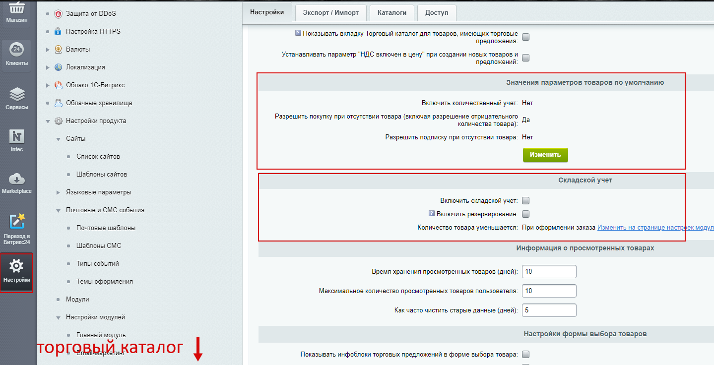
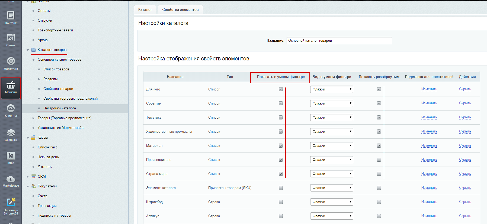
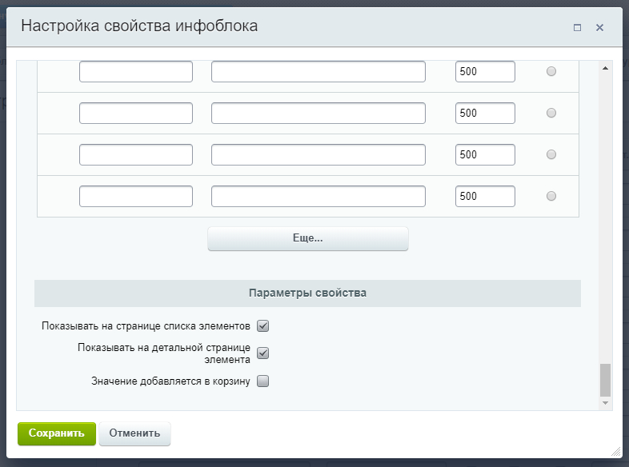

# Настройки для магазин (заметки)

- Настройки модуля → Торговый каталог
	- Складской учет (настраиваем как нужно: покупать с остатками / без остатков)

# Настройка компонента catalog

- Необходимо выборать тип цены
- Поиском в браузере находит и отмечаем
	- "Показывать остаток товара" - отключаем, если надо
	
# Настройка умного фильтра

- Магазин → Каталоги товаров → Настройки каталога
	- Отмечаем, что показывать в умном фильтре и что показывать развернутым/свернутым 

- Настройки компонента раздел "Умного фильтра", указываем:
	 - Свойства по которым нужно фильтровать
	 - Указываем тип цены
	 
# Показ свойств в списке / на детальной

- Для вывода свойств нужно зайти в настройки инфоблока: 
	- → зайти и изменить каждое свойства 
	- → далее в самый низ 
	- → выбираем нужные пункты  
		- «Показывать на странице списка элементов»
		- «Показывать на детальной странице элемента».

 
 
# Фасетные индексы

Не забываем про фасетные индексы

# Обмен с 1С

- png могут не доходить картинки до сайта (проблема в последнем модуле обмена версия ~20)